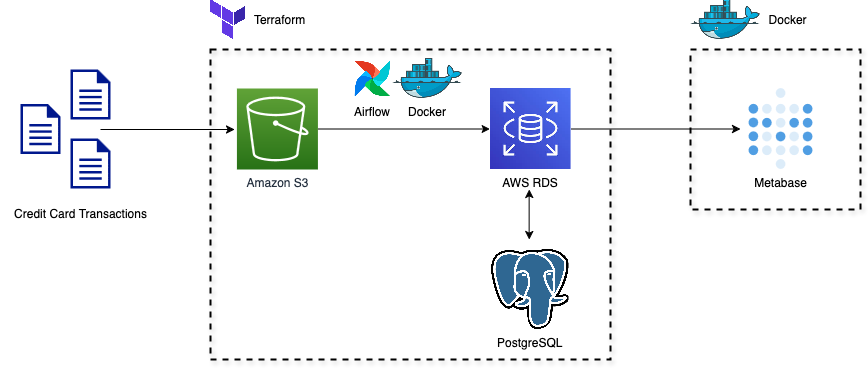
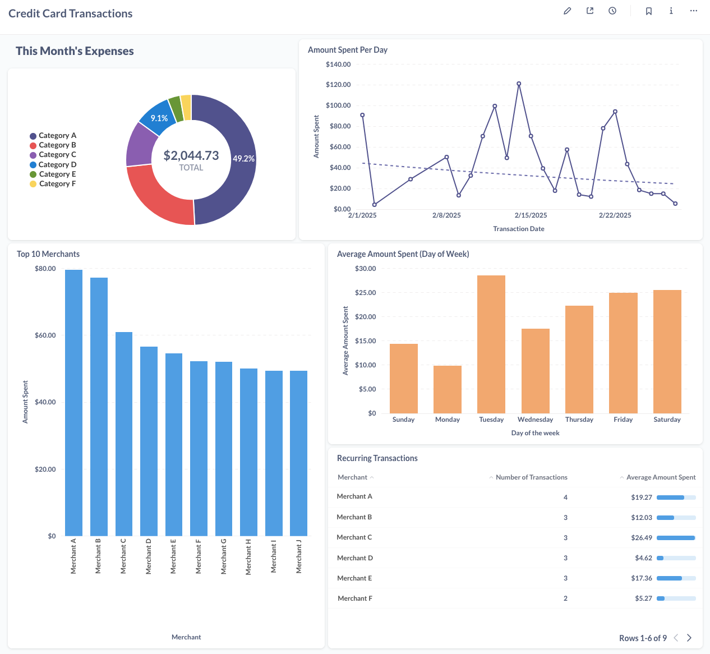
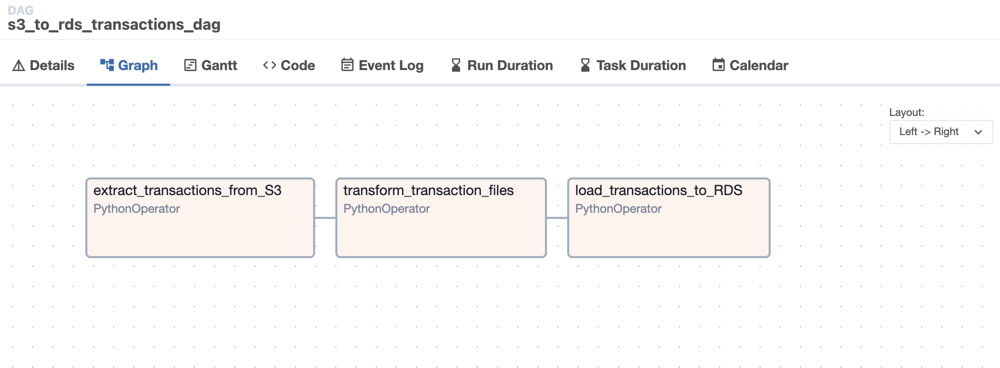

# CreditSync
An AWS-powered ETL data pipeline that automates the synchronization of credit card transactions for personal finance tracking

## 🎯 Motivation
Keeping track of spending across multiple credit cards can be tedious, requiring me to log into each account separately and manually log each transaction. At the end of each month, I calculate my expenses to determine how much I can allocate towards savings and investments, but this process is inefficient and time-consuming.

To simplify and automate my personal finance tracking, I wanted a system to synchronize all my credit card transactions into one centralized dashboard. **CreditSync** enables me to visualize my spending habits, monitor savings, and streamline monthly financial planning. 

Beyond tracking my spending, this project was a valuable learning opportunity — allowing me to enhance my data engineering and cloud computing skills by automating my finances.

## 🏗️ Architecture 
1. **AWS S3** - Cloud storage for raw transactions data
2. **Apache Airflow** - Orchestrates ETL workflows within a Dockerized environment
3. **Amazon RDS (PostgreSQL)** - Database to store cleaned and processed transactions data
4. **Metabase** - Visualizes expenses and spending patterns
5. **Terraform** - Deploys AWS infrastructure via Infrastructure-as-Code (IaC)



## 📊 Output 
A Metabase dashboard that provides an interactive breakdown of expenses by category, merchant, time, and credit card provider. The dashboard is fully customizable using SQL. 



## 📝 Prerequisites
Before setting up **CreditSync**, please ensure you have:
1. Created an [AWS Account](https://aws.amazon.com/free/)
2. Installed and configured [AWS CLI](https://docs.aws.amazon.com/cli/latest/userguide/install-cliv2.html)
3. Installed [Docker Engine](https://docs.docker.com/engine/install/) and [Docker Compose](https://docs.docker.com/compose/install/) for your OS


## 🔧 Setup Guide
### 1. Set Up AWS Infrastructure with Terraform
Create a `terraform.tfvars` file inside the `infra` directory and define the following variables:
```hcl
aws_region   = "your-aws-region"       # Change to your preferred region
rds_db_name  = "transactionsDB"        # Keep this 
rds_username = "your-username"         # Change to your preferred username
rds_password = "your-secure-password"  # Change to your preferred password
```

Deploy AWS infrastructure using Terraform:
```bash
cd infra
terraform init
terraform apply
```

This will create the following AWS resources:
- **S3 Bucket:** `personal-finance-transactions`
- **Amazon RDS (PostgreSQL)**: `transactionsDB` with a `credit_card_transactions` table
- **IAM User:** `airflow-user` with permissions for Airflow to interact with AWS services

Once Terraform completes, it will display key information, including credentials. To retrieve sensitive values:
```bash
terraform output -raw airflow_user_secret_key
terraform output -raw rds_instance_password
```

### 2. Deploy & Configure Apache Airflow
To deploy Apache Airflow in a **Dockerized environment**, run the following in the root directory:
```bash
docker-compose up
```

Access the **Airflow UI** at `http://localhost:8080/` and login using airflow default credentials:
- **Username:** airflow
- **Password:** airflow

In the Airflow UI, navigate to Admin → Connections and configure the following:
1. **AWS Connection:**
   - **Connection Id:** airflow-user
   - **Connection Type:** Amazon Web Services
   - **AWS Access Key ID:** `airflow_user_access_key`
   - **AWS Secret Access:** `airflow_user_secret_key`

2. **PostgreSQL Connection:**
   - **Connection Id:** transactionsDB
   - **Host:** `rds_instance_endpoint`
   - **Database:** `rds_instance_db_name`
   - **Username:** `rds_instance_username`
   - **Password:** `rds_instance_password`
   - **Port:** 5432

### 3. Set up Metabase
Start a Metabase container by running:
```bash
docker run -d -p 3000:3000 --name metabase metabase/metabase
```
Access the **Metabase UI** at `http://localhost:3000/` and write SQL queries to create your dashboard!

### 4. Upload CSVs to S3
Manually upload transaction CSV files to your S3 bucket or set up an automated data ingestion process.

*Currently Supported Banks:*
- Chase
- Capital One
- Bilt Rewards

### 5. Run the `s3_to_rds_transactions_dag` in Airflow!



## Monthly Reset:
To prepare the S3 bucket for the next month's transactions, run the following command:
```bash
terraform destroy -target=aws_s3_bucket.transactions_bucket
```
This will remove the S3 bucket (`aws_s3_bucket.transactions_bucket`) and detach IAM policy associated with Airflow (`aws_iam_policy.airflow_policy`, `aws_iam_user_policy_attachment.airflow_policy_attach`). Other AWS resources, including the RDS instance, will remain intact unless explicitly destroyed.

To tear down Airflow, run the following commmand:
```bash
docker-compose down
```

**Note:** To completely tear down AWS infrastructure, comment out or remove all the following blocks from `main.tf`.
```hcl
lifecycle {
    prevent_destroy = true
}
``` 
